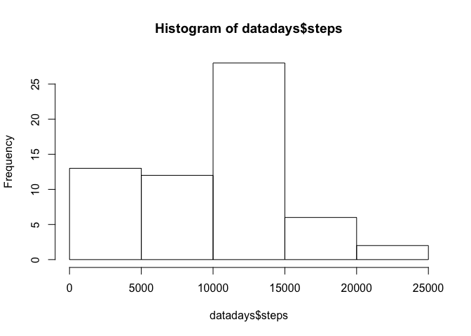
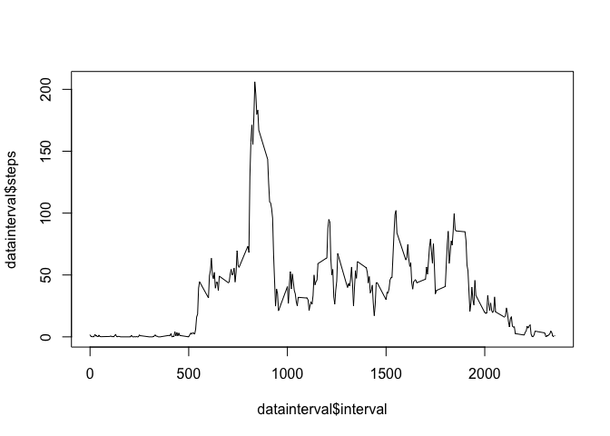
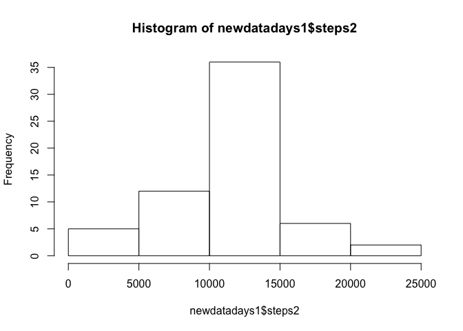
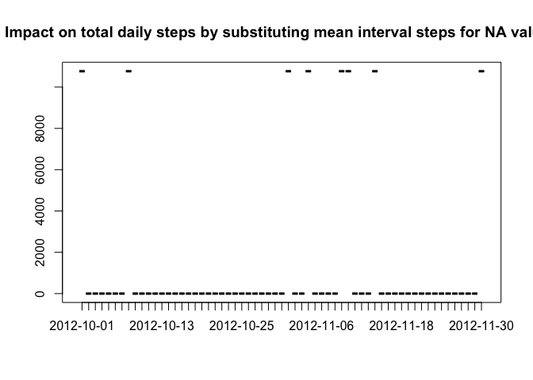
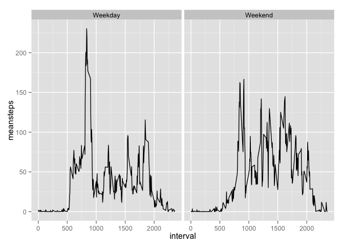

# Reproducible Research: Peer Assessment 1
Hao Wang  

This is an analysis of the Activity monitoring data as per instructions from [Coursera's Reproducible Research Class](https://github.com/rdpeng/RepData_PeerAssessment1).


To start, this reads and processes the data:


```r
library(dplyr)
```

```
## 
## Attaching package: 'dplyr'
## 
## The following object is masked from 'package:stats':
## 
##     filter
## 
## The following objects are masked from 'package:base':
## 
##     intersect, setdiff, setequal, union
```


```r
data <- tbl_df(read.csv("./activity.csv"))
```

#The first question is: **What is the mean total number of steps per day?**

1. Calculate the total number of steps taken per day


```r
datadays <- group_by(data, date)
datadays <- summarise(datadays, steps = sum(steps, na.rm=TRUE))
print(datadays, n=61)
```

```
## Source: local data frame [61 x 2]
## 
##          date steps
## 1  2012-10-01     0
## 2  2012-10-02   126
## 3  2012-10-03 11352
## 4  2012-10-04 12116
## 5  2012-10-05 13294
## 6  2012-10-06 15420
## 7  2012-10-07 11015
## 8  2012-10-08     0
## 9  2012-10-09 12811
## 10 2012-10-10  9900
## 11 2012-10-11 10304
## 12 2012-10-12 17382
## 13 2012-10-13 12426
## 14 2012-10-14 15098
## 15 2012-10-15 10139
## 16 2012-10-16 15084
## 17 2012-10-17 13452
## 18 2012-10-18 10056
## 19 2012-10-19 11829
## 20 2012-10-20 10395
## 21 2012-10-21  8821
## 22 2012-10-22 13460
## 23 2012-10-23  8918
## 24 2012-10-24  8355
## 25 2012-10-25  2492
## 26 2012-10-26  6778
## 27 2012-10-27 10119
## 28 2012-10-28 11458
## 29 2012-10-29  5018
## 30 2012-10-30  9819
## 31 2012-10-31 15414
## 32 2012-11-01     0
## 33 2012-11-02 10600
## 34 2012-11-03 10571
## 35 2012-11-04     0
## 36 2012-11-05 10439
## 37 2012-11-06  8334
## 38 2012-11-07 12883
## 39 2012-11-08  3219
## 40 2012-11-09     0
## 41 2012-11-10     0
## 42 2012-11-11 12608
## 43 2012-11-12 10765
## 44 2012-11-13  7336
## 45 2012-11-14     0
## 46 2012-11-15    41
## 47 2012-11-16  5441
## 48 2012-11-17 14339
## 49 2012-11-18 15110
## 50 2012-11-19  8841
## 51 2012-11-20  4472
## 52 2012-11-21 12787
## 53 2012-11-22 20427
## 54 2012-11-23 21194
## 55 2012-11-24 14478
## 56 2012-11-25 11834
## 57 2012-11-26 11162
## 58 2012-11-27 13646
## 59 2012-11-28 10183
## 60 2012-11-29  7047
## 61 2012-11-30     0
```

2. Make a histogram of the total number of steps taken each day


```r
hist(datadays$steps)
```

 

3. Calculate and report the mean and median of the total number of steps taken per day


```r
summary(datadays$steps)
```

```
##    Min. 1st Qu.  Median    Mean 3rd Qu.    Max. 
##       0    6778   10400    9354   12810   21190
```

#The second question is: **What is the average daily activity pattern?**

1. Make a time series plot (i.e. type = "l") of the 5-minute interval (x-axis) and the average number of steps taken, averaged across all days (y-axis)


```r
datainterval <- group_by(data, interval)
datainterval <- summarise(datainterval, steps = mean(steps, na.rm=TRUE))
plot(datainterval$interval, datainterval$steps, type = "l")
```

 

2. Which 5-minute interval, on average across all the days in the dataset, contains the maximum number of steps?


```r
datainterval[which.max(datainterval$steps),]
```

```
## Source: local data frame [1 x 2]
## 
##   interval    steps
## 1      835 206.1698
```

#The third question deals with **imputing missing values** for NAs.

1. Calculate and report the total number of missing values in the dataset (i.e. the total number of rows with NAs).  *The summary() function gives the total number of NAs.*


```r
summary(data)
```

```
##      steps                date          interval     
##  Min.   :  0.00   2012-10-01:  288   Min.   :   0.0  
##  1st Qu.:  0.00   2012-10-02:  288   1st Qu.: 588.8  
##  Median :  0.00   2012-10-03:  288   Median :1177.5  
##  Mean   : 37.38   2012-10-04:  288   Mean   :1177.5  
##  3rd Qu.: 12.00   2012-10-05:  288   3rd Qu.:1766.2  
##  Max.   :806.00   2012-10-06:  288   Max.   :2355.0  
##  NA's   :2304     (Other)   :15840
```

2-3. Devise a strategy for filling in all of the missing values in the dataset.


```r
library(plyr)
```

```
## -------------------------------------------------------------------------
## You have loaded plyr after dplyr - this is likely to cause problems.
## If you need functions from both plyr and dplyr, please load plyr first, then dplyr:
## library(plyr); library(dplyr)
## -------------------------------------------------------------------------
## 
## Attaching package: 'plyr'
## 
## The following objects are masked from 'package:dplyr':
## 
##     arrange, count, desc, failwith, id, mutate, rename, summarise,
##     summarize
```

```r
#Joining the step mean by interval table to the larger data
datajoin <- join(data, datainterval, by = "interval")
colnames(datajoin)[4] <- "intervalmean"

#creating a new column that takes the interval mean if step value is otherwise NA
data2 <- mutate(datajoin, steps2 = ifelse(is.na(datajoin$steps)==FALSE, steps, intervalmean))

newdata <- select(data2, steps2, date, interval)
```

*I am replacing all NA values with interval means, as previously calculated and reconstituting into a table called newdata.*

4. Make a histogram of the total number of steps taken each day and Calculate and report the mean and median total number of steps taken per day.


```r
detach(package:plyr)
library(dplyr)
newdatadays <- group_by(newdata, date)
newdatadays1 <- summarise(newdatadays, steps2 = sum(steps2, na.rm=TRUE))
hist(newdatadays1$steps2)
```

 

```r
newdatadays <- group_by(newdata, date)
newdatadays2 <- summarise(newdatadays, meansteps = mean(steps2, na.rm=TRUE), mediansteps = median(steps2, na.rm=TRUE))
print(newdatadays2, n=61)
```

```
## Source: local data frame [61 x 3]
## 
##          date  meansteps mediansteps
## 1  2012-10-01 37.3825996    34.11321
## 2  2012-10-02  0.4375000     0.00000
## 3  2012-10-03 39.4166667     0.00000
## 4  2012-10-04 42.0694444     0.00000
## 5  2012-10-05 46.1597222     0.00000
## 6  2012-10-06 53.5416667     0.00000
## 7  2012-10-07 38.2465278     0.00000
## 8  2012-10-08 37.3825996    34.11321
## 9  2012-10-09 44.4826389     0.00000
## 10 2012-10-10 34.3750000     0.00000
## 11 2012-10-11 35.7777778     0.00000
## 12 2012-10-12 60.3541667     0.00000
## 13 2012-10-13 43.1458333     0.00000
## 14 2012-10-14 52.4236111     0.00000
## 15 2012-10-15 35.2048611     0.00000
## 16 2012-10-16 52.3750000     0.00000
## 17 2012-10-17 46.7083333     0.00000
## 18 2012-10-18 34.9166667     0.00000
## 19 2012-10-19 41.0729167     0.00000
## 20 2012-10-20 36.0937500     0.00000
## 21 2012-10-21 30.6284722     0.00000
## 22 2012-10-22 46.7361111     0.00000
## 23 2012-10-23 30.9652778     0.00000
## 24 2012-10-24 29.0104167     0.00000
## 25 2012-10-25  8.6527778     0.00000
## 26 2012-10-26 23.5347222     0.00000
## 27 2012-10-27 35.1354167     0.00000
## 28 2012-10-28 39.7847222     0.00000
## 29 2012-10-29 17.4236111     0.00000
## 30 2012-10-30 34.0937500     0.00000
## 31 2012-10-31 53.5208333     0.00000
## 32 2012-11-01 37.3825996    34.11321
## 33 2012-11-02 36.8055556     0.00000
## 34 2012-11-03 36.7048611     0.00000
## 35 2012-11-04 37.3825996    34.11321
## 36 2012-11-05 36.2465278     0.00000
## 37 2012-11-06 28.9375000     0.00000
## 38 2012-11-07 44.7326389     0.00000
## 39 2012-11-08 11.1770833     0.00000
## 40 2012-11-09 37.3825996    34.11321
## 41 2012-11-10 37.3825996    34.11321
## 42 2012-11-11 43.7777778     0.00000
## 43 2012-11-12 37.3784722     0.00000
## 44 2012-11-13 25.4722222     0.00000
## 45 2012-11-14 37.3825996    34.11321
## 46 2012-11-15  0.1423611     0.00000
## 47 2012-11-16 18.8923611     0.00000
## 48 2012-11-17 49.7881944     0.00000
## 49 2012-11-18 52.4652778     0.00000
## 50 2012-11-19 30.6979167     0.00000
## 51 2012-11-20 15.5277778     0.00000
## 52 2012-11-21 44.3993056     0.00000
## 53 2012-11-22 70.9270833     0.00000
## 54 2012-11-23 73.5902778     0.00000
## 55 2012-11-24 50.2708333     0.00000
## 56 2012-11-25 41.0902778     0.00000
## 57 2012-11-26 38.7569444     0.00000
## 58 2012-11-27 47.3819444     0.00000
## 59 2012-11-28 35.3576389     0.00000
## 60 2012-11-29 24.4687500     0.00000
## 61 2012-11-30 37.3825996    34.11321
```

#Do these values differ from the estimates from the first part of the assignment?  What is the impact of imputing missing data on the estimates of the total daily number of steps?

*In short, substituting does have an impact, and a significant one at that, but only on specific days.  Most of the dates do not have NA values, and therefore the impact is zero.*


```r
datajoin <- left_join(datadays, newdatadays1)
```

```
## Joining by: "date"
```

```r
datajoin <- mutate(datajoin, delta = (steps2 - steps))
plot(datajoin$date, datajoin$delta, main = "Impact on total daily steps by substituting mean interval steps for NA values")
```

 


#The last question asks: **Are there differences in activity patterns between weekdays and weekends?**

*Yes, at a high level, there are.  On weekdays, the volatility is higher, and on the weekends, activity seems to start a bit later in the day.* 

1. Create a new factor variable in the dataset with two levels – “weekday” and “weekend” indicating whether a given date is a weekday or weekend day.


```r
library(lubridate)
dates1 <- mutate(newdata, date = ymd(date))
dates1 <- mutate(dates1, day = weekdays(date))
dates1 <- mutate(dates1, weekday = ifelse(day == "Sunday", "Weekend", ifelse(day == "Saturday", "Weekend", "Weekday")))
```

2. Make a panel plot containing a time series plot (i.e. type = "l") of the 5-minute interval (x-axis) and the average number of steps taken, averaged across all weekday days or weekend days (y-axis).


```r
library(ggplot2)
dates1 <- tbl_df(dates1)
dates2 <- group_by(dates1, weekday, interval)
dates3 <- summarise(dates2, meansteps = mean(steps2))

graph <- ggplot(dates3, aes(x=interval, y=meansteps)) + geom_line()
graph <- graph + facet_grid(. ~ weekday)
graph
```

 
